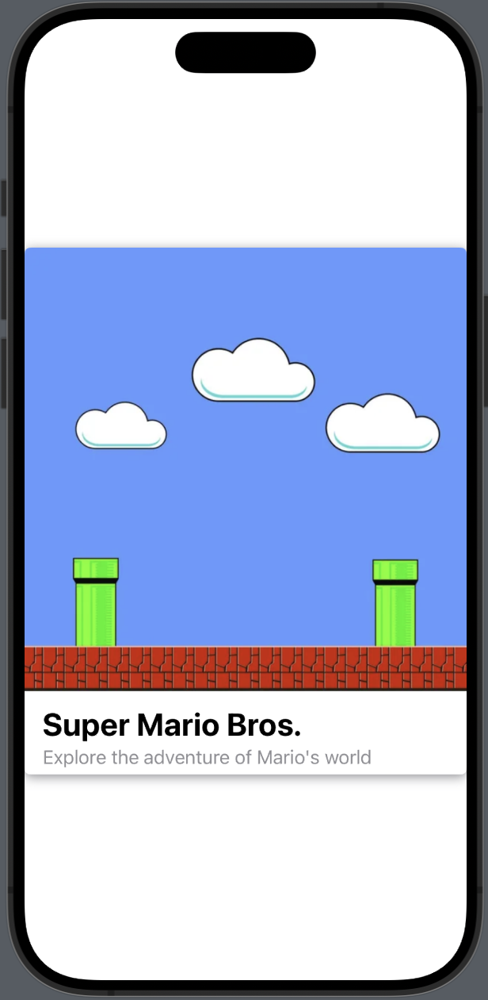

# SwiftUI-Repo

## The repository is grounded in samples and blueprints of iOS methodologies, offering insights into the development of applications, frameworks, and playgrounds.

1. Creating a custom Card

   ```CustomCardView``` ```SwiftUI``` declares the custom card.
   ```swift
	struct CustomCardView: View {
    	    var body: some View {
        	VStack(alignment: .leading) {
            	    Image("world")
                        .resizable()
                        .aspectRatio(contentMode: .fit)
                   VStack(alignment: .leading) {
                        Text("Super Mario Bros.")
                            .font(.title)
                            .fontWeight(.bold)
                        Text("Explore the adventure of Mario's world")
                            .foregroundColor(Color(.systemGray))
                   }
                   .padding(.horizontal)
                   .padding(.vertical, 5)
                }
                .background(Color.white)
                .cornerRadius(5)
                .shadow(color: Color.gray, radius: 5, x: 0, y: 2)
                .padding(.bottom, 5)
           }
       }




2. Dependency Injection

3. Networking

4. Pagination

5. Searching

6. Data persisting

7. async/await


_created by Israel Manzo 2021, updated on 2023_
